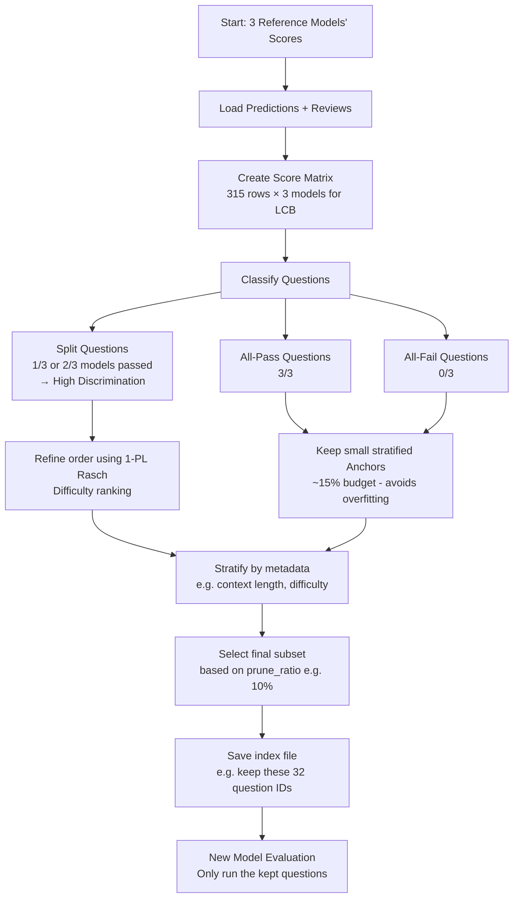
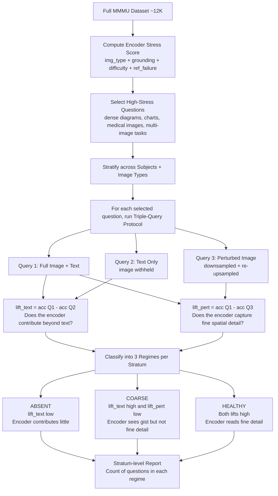

# Architecture flowcharts

## Diagram 1 - LCB + AA-LCR Pruner

```mermaid
flowchart TD
    A[Start: 3 Reference Models' Scores] --> B[Load Predictions + Reviews]
    B --> C[Create Score Matrix<br/>315 rows × 3 models for LCB]
    C --> D[Classify Questions]
    D --> E1[Split Questions<br/>1/3 or 2/3 models passed<br/>→ High Discrimination]
    D --> E2[All-Pass Questions<br/>3/3]
    D --> E3[All-Fail Questions<br/>0/3]
    
    E1 --> F[Refine order using 1-PL Rasch<br/>Difficulty ranking]
    E2 & E3 --> G[Keep small stratified Anchors<br/>~15% budget - avoids overfitting]
    
    F & G --> H[Stratify by metadata<br/>e.g. context length, difficulty]
    H --> I[Select final subset<br/>based on prune_ratio e.g. 10%]
    I --> J[Save index file<br/>e.g. keep these 32 question IDs]
    J --> K[New Model Evaluation<br/>Only run the kept questions]
```

## Diagram 2 — MMMU Encoder Probe

```mermaid
flowchart TD
    A[Full MMMU Dataset ~12K] --> B[Compute Encoder Stress Score<br/>img_type + grounding + difficulty + ref_failure]
    B --> C[Select High-Stress Questions<br/>dense diagrams, charts, medical images, multi-image tasks]
    C --> D[Stratify across Subjects + Image Types]

    D --> E[For each selected question, run Triple-Query Protocol]

    E --> F1[Query 1: Full Image + Text]
    E --> F2[Query 2: Text Only<br/>image withheld]
    E --> F3[Query 3: Perturbed Image<br/>downsampled + re-upsampled]

    F1 --> G[lift_text = acc Q1 - acc Q2<br/>Does the encoder contribute beyond text?]
    F2 --> G

    F1 --> H[lift_pert = acc Q1 - acc Q3<br/>Does the encoder capture fine spatial detail?]
    F3 --> H

    G --> I[Classify into 3 Regimes per Stratum]
    H --> I

    I --> J1[ABSENT<br/>lift_text low<br/>Encoder contributes little]
    I --> J2[COARSE<br/>lift_text high and lift_pert low<br/>Encoder sees gist but not fine detail]
    I --> J3[HEALTHY<br/>Both lifts high<br/>Encoder reads fine detail]

    J1 --> K[Stratum-level Report<br/>Count of questions in each regime]
    J2 --> K
    J3 --> K
```